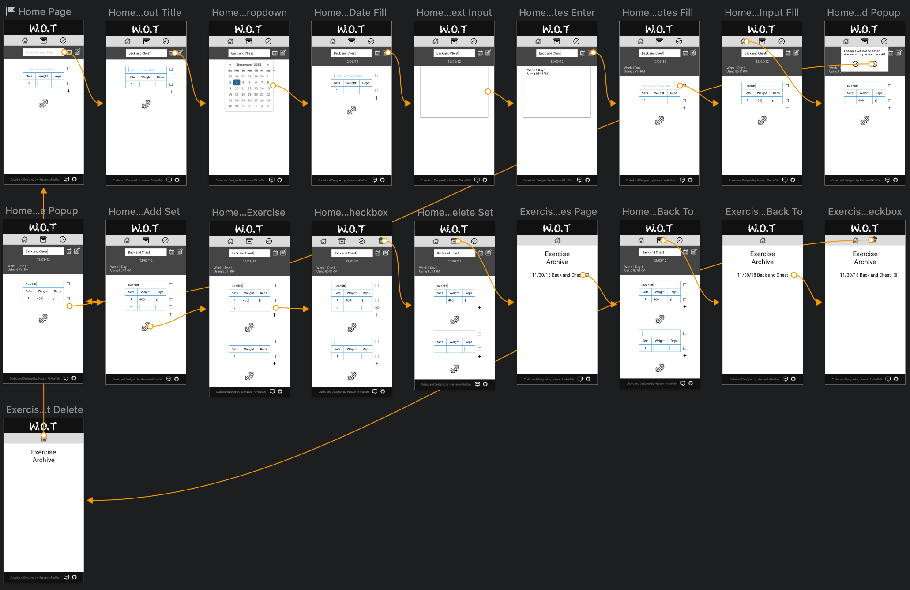

# W.O.T. (Workout Tracker)

#### Final Capstone Project, Starting date: 11/30/2018

#### By _Hassan Al-khalifah_

## Description

W.O.T (Workout Tracker) is an application designed to make keeping track of workouts and workout habits a lot easier.

When opening the app, the user is presented with two links, a create new workout option and a archive option.

The create new workout option will open up a workout form which allows the user to fill in the form as the workout goes. The form consist of the following:
* A date selector to give the user the option to choose the date of the workout.
* An initial (starting) notes section to allow the user to include any specifics about the exercise. Examples: Body parts worked, rest time goals, workout percentages etc.
* An initial exercise input that allows the user to enter details about an exercise being performed. This consist of the following:
  * It allows the user to enter the exercise name.
  * It allow the user to enter an initial workout weight and reps completed. This is considered one set. If the user requires, additional sets can be added with a simple click of the visible plus sign.
If the user requires, additional exercises can be added with the click of the add new exercise button.
* An additional notes section which would allow the user to keep notes on diet, mood etc.
* A submit button to allow the user to store the workout completed for later viewing.

The archive option will open up a list of workouts completed and submitted. The user can click on any of the workout to view all information entered and the option to edit and save edits will be available to the user.

## User Stories

* As a user, I want to be able to create a new workout.
* As a user, I want the ability to selected a date I worked out on.
* As a user, I want the ability to enter initial notes/thoughts about my workout.
* As a user, I want the ability to create or delete as many exercises as I want.
* As a user, when creating a new exercise, I want a place to be able to enter a exercise name which allows me to add an set the includes a place to enter workout weight and reps performed.
* As a user, when creating a new exercise, I want the ability to add additional sets of workout weights and reps complete and, if required, the ability to delete sets.
* As a user, I want the ability to add additional notes about the workout, mood, diet etc.
* As a user, I want the ability to be able to submit my workout to be stored for later viewing purposes.
* As a user, I want to be able to see an exhausted list of previous workouts and the option view their details.
* As a user, I want the ability to edit previous workouts and an option to save edits.

## Website Sketch and Wireframe Sketch


## Prototypes/Wireframe



## Components and Route Structure


## Setup Instructions

* Open terminal
* Make sure you are in the Desktop directory
```
~ $ cd desktop
```
* Clone the repo
```
~/Desktop $ git clone [REPO URL]
```
* Navigate into main directory of cloned REPO
```
~/Desktop $ cd directory-name
```
* If you are using a mac, consider changing linebreak-style from "windows" to "unix" in the .eslintrc.json file
* Run npm install in terminal to install all required dependencies
```
~/Desktop/directory-name $ npm install
```
* Make sure your atom react package is version 0.17.0. If not, install it
```
~/Desktop/directory-name $ apm install react@0.17.0
```
* Be sure to have the following dependencies installed globally:
```
~/Desktop/directory-name $ webpack@3.4.0 -g
~/Desktop/directory-name $ webpack-dev-server@2.5.0 -g
~/Desktop/directory-name $ eslint@4.13.1 -g
~/Desktop/directory-name $ eslint-plugin-react@7.10.0 -g
```
* Run npm run start in terminal to run server, which will be viewed at http://localhost:8080
```
~/Desktop/directory-name $ npm run start
```

## Technologies Used

* HTML5
* CSS3
* JavaScript (ES6)
* JSX
* React
* Redux
* Webpack
* Babel
* ESLint
* Jest
* prop-types
* UUID
* Git
* Github
* Firebase
* Sketch

## License

This software is licensed under the MIT license.

Copyright (c) 2018 **Hassan Al-khalifah**
